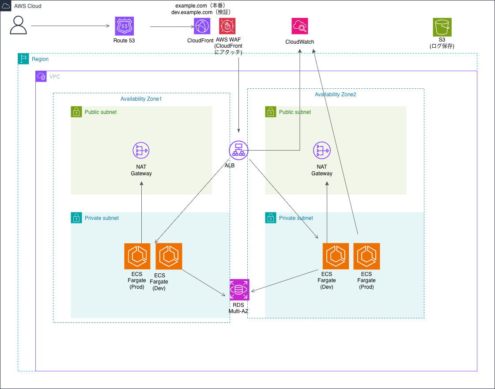

# AWS Infrastructure Portfolio - Nagoyameshi 🍜

> **Terraform と AWS を利用して、Webアプリケーション基盤をゼロから設計・構築したインフラポートフォリオです。**


---

# 📌 Project Overview

Laravel アプリケーションを AWS 上へデプロイすることを目的に、
Terraform を利用してインフラをコード化しました。

AWS の各サービスを組み合わせ、

- 可用性
- セキュリティ
- 保守性
- Infrastructure as Code

を意識した構成となっています。

---

# 📊 Project Summary

|項目|内容|
|---|---|
|Cloud|AWS|
|IaC|Terraform|
|Application|Laravel|
|Container|ECS Fargate|
|Database|Amazon RDS(MySQL)|
|Network|VPC / Public・Private Subnet|
|HTTPS|CloudFront + ACM|
|Security|AWS WAF・IAM・Security Group|

---

# 🏗️ Architecture

<p align="center">

</p>

---

# 📄 Project Documents

このプロジェクトでは、設計・構築だけでなく、提案・見積・パラメータ設計まで一貫して実施しました。

|Document|Description|
|---|---|
|📑 [Proposal](docs/proposal.pdf)|システム提案書|
|💰 [AWS Cost Estimate](docs/estimate.pdf)|AWS利用料金見積書|
|📋 [Parameter Sheet](docs/parameter-sheet.pdf)|AWS設定一覧|

---

# ☁️ AWS Services

|サービス|役割|
|---|---|
|Amazon VPC|ネットワーク|
|Public / Private Subnet|ネットワーク分離|
|Internet Gateway|インターネット接続|
|NAT Gateway|Private Subnetからの外部通信|
|Amazon ECS Fargate|Laravel実行環境|
|Application Load Balancer|負荷分散|
|Amazon RDS(MySQL)|データベース|
|Amazon Route53|DNS|
|Amazon CloudFront|CDN|
|AWS Certificate Manager|SSL証明書|
|AWS WAF|Webアプリケーション保護|
|AWS Systems Manager Parameter Store|パラメータ管理|
|Amazon CloudWatch|ログ・監視|

---

# ✨ Features

- Terraform による Infrastructure as Code
- Multi-AZ 構成
- Public / Private Subnet を利用したネットワーク設計
- ECS Fargate によるコンテナ運用
- CloudFront + ACM による HTTPS 配信
- WAF によるアクセス制御
- IAM ロールによる最小権限設計
- Systems Manager Parameter Store による機密情報管理

---

# 📂 Directory Structure

```text
nagoyameshi-infra/
├── main.tf
├── variables.tf
├── outputs.tf
├── vpc.tf
├── sg.tf
├── alb.tf
├── ecs.tf
├── rds.tf
├── route53.tf
├── cloudfront.tf
├── acm.tf
├── iam.tf
├── ssm.tf
├── waf.tf
├── s3.tf
├── images/
│   └── architecture.png
├── docs/
│   ├── proposal.pdf
│   ├── architecture.pdf
│   ├── estimate.pdf
│   └── parameter-sheet.pdf
└── README.md
```

---

# ✅ Deployment Result

- Terraform による AWS インフラ構築
- ECS Fargate への Laravel アプリケーションデプロイ
- Amazon RDS(MySQL) との接続確認
- Application Load Balancer 経由での公開
- CloudFront + ACM による HTTPS 配信
- Route53 による独自ドメイン設定
- AWS WAF によるアクセス制御

---

# 🌐 URL

**https://chamcham.blog**

---

# 💡 What I Learned

このプロジェクトを通して、Terraform を利用した Infrastructure as Code を実践し、
AWS のネットワーク設計からアプリケーション公開まで、一連のインフラ構築を経験しました。

また、ECS Fargate・RDS・ALB・CloudFront・Route53・ACM・WAF など複数の AWS サービスを組み合わせ、
可用性・セキュリティ・運用性を意識した構成を設計・構築しました。

Terraform によるコード管理を行うことで、インフラの再現性・保守性の重要性についても学びました。

---

# 🚀 Future Improvements

- GitHub Actions を利用した CI/CD
- Auto Scaling の導入
- CloudWatch Alarm + SNS 通知
- Blue/Green Deployment
- Terraform Module 化
- ECS サービスのスケール最適化
